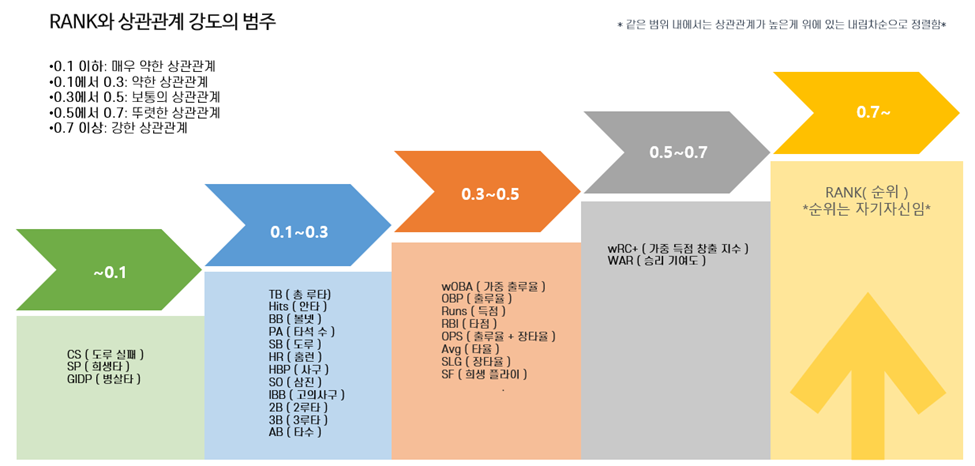

 

# ⚾ KBO 순위와 타자 지표 상관관계 분석

> 본 프로젝트는 지난 40년간(1982~2022) KBO 정규시즌 데이터를 활용하여  
> **팀 순위와 타격 지표 간의 상관관계**를 분석한 결과를 담고 있습니다.  
> 야구 팬으로서 "어떤 타격 지표가 팀 순위에 가장 큰 영향을 미치는가?"라는 질문에서 출발했습니다.

 

## 📖 프로젝트 개요
- **주제 선정 이유**: KBO 정규시즌 데이터 속에서 팀 성적을 좌우하는 핵심 타격 지표를 규명하기 위함  
- **목표**: 팀 순위와 타격 지표 간의 상관관계를 분석하여, 성적에 가장 큰 영향을 주는 요인을 도출  
- **환경**: Python (Google Colab) 기반 분석 환경  
- **데이터 출처**: [STATIZ](http://www.statiz.co.kr/) (1982~2022 시즌 데이터)  
- **데이터 형태**: CSV (타격 지표, 팀 순위 데이터셋)
 

## 🔎 데이터 수집 및 전처리
- **데이터 출처**: [STATIZ](http://www.statiz.co.kr/)  
- **수집 방법**: Colab + BeautifulSoup 크롤링 → CSV 저장 → Excel 전처리  
- **전처리 내용**  
  - WAR 기반 순위를 정규리그 순위로 변환  
  - 각 연도별 경기 수 차이를 반영 (경기당 비율로 계산)  
  - 오류 데이터 확인 및 색상 시각화 처리  

  

 

## 📊 분석 방법론
- **Scatter Plot**: 순위와 지표 분포 시각화 (이상치 존재)  
- **Box Plot**: 이상치 제거 후 직관적 비교 가능  
- **상관계수(Correlation Analysis)**: 지표와 순위 간의 연관성 수치화  
- **시대 구분**:  
  - 6개 구단 (1982~1985)  
  - 8개 구단 (1991~2012)  
  - 10개 구단 (2015~현재)

  

 

## 📈 시각화
- 순위별 Box Plot  
- 상관계수 Heatmap / Graph  
- 드롭다운 위젯을 통한 지표별 비교 (Colab 기반)  

  

 

## 🏆 결과 및 결론
- **가장 높은 상관관계 지표**:  
  1. wRC+ (가중 득점 창출 지수)  
  2. WAR (승리 기여도)  
  3. wOBA (가중 출루율)  
  4. OBP (출루율)  
- 8개 구단 시절 데이터가 상대적으로 더 유의미한 결과를 보임  
- 결론: **팀 순위를 좌우하는 핵심은 단순 안타/홈런이 아닌 종합 지표 (wRC+, WAR 등)**

  

 

## ⚙️ 사용 기술
- **언어/환경**: Python (Google Colab)  
- **데이터 수집**: BeautifulSoup, CSV  
- **분석/시각화**: Pandas, Matplotlib, Seaborn  
- **문서화**: PPT, Word

 

## 📎 참고 자료
해당 README는 요약본이며, 자세한 설계 문서 및 이미지 자료는 아래 첨부 문서에서 확인 가능합니다.

- 📄 [KBO순위_타자지표_상관관계_분석.pptx](./KBO순위_타자지표_상관관계_분석.pptx)
